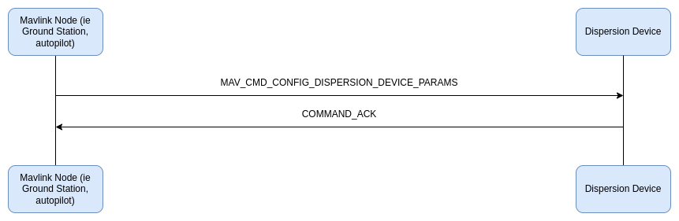

# Dispersion Microservice

## Introduction

The dispersion protocol allows MAVLink control over the dispersion devices mounted on a vehicle from a variety of sources. The dispersion state can be managed manually by an operator in real time or set as part of an auto mission.

The protocol defines what information is published, in what order for key workflow sequences for developers, configurators, and users of the vehicle. It also defines a logging framework for storage of that information.

The protocol supports a variety of hardware configurations, and enables dispersion systems with a variety of capabilities.

## Concepts

The MAVLink messages for interacting with the dispersion device can typically fit into the following categories:

- configuration - low frequency messages intended to change the behavior of dispersion device for long periods of time
- control - high frequency messages providing real time flight information and corrections to the device to ensure the desired application is achieved
- locking - provides a locking and unlocking mechanism, that ensures the dispersion device stops dispersing and does not respond to control messages when locked
- status - report the device state at a scheduled interval or on key events

### Recommended Hardware Set-up

This protocol is designed to work best with a standalone MAVLink dispersion device that shares a high throughput, low latency communication bus with its controller. While any MAVLink source can be used to control the device, a common configuration is to have an autopilot providing critical real time flight data and a ground station to manage locking or low frequency control and configuration.

### Logging

To accomodate the creation of effectiveness and compliance reports for a specific application, a mini logging infrastructure is proposed. Effectively all MAVLink messages as handled by the Dispersion Device should be logged into a binary file that can then be retrieved using the [File Transfer Protocol](https://mavlink.io/en/services/ftp.html) pointed at the `logger_dir_ftp_url` on [DISPERSION_MANAGER_INFORMATION](#dispersion_manager_information). This logging logic should take place within the Dispersion Device. See [logging implementation details](#logging-implementation).

## Implementation and Messages

### Discovery of Dispersion Device

The MAVlink nodes that need to communicate with Dispersion Devices start the process by sending a broadcast [MAV_CMD_REQUEST_MESSAGE](https://mavlink.io/en/messages/common.html#MAV_CMD_REQUEST_MESSAGE) for [DISPERSION_DEVICE_INFORMATION](#dispersion_device_information). Every dispersion device should respond with [DISPERSION_DEVICE_INFORMATION](#dispersion_device_information).

The MAVLink node should then create as many interface instances as Dispersion Devices found.

### Configuration

The dispersion device has some parameters that might need to be set occasionally at run time but are event driven and dependent on what operators are trying to accomplish. This is a rather small set of information so the pre-existing [MAVLink command microservice](https://mavlink.io/en/services/command.html) is used for this. The [MAV_CMD_DO_CONFIG_DISPERSION_PARAMS](#mav-cmd-do-config-dispersion-params) can be used to set device parameters such as min/max rate, min/max pressure, reference speed, etc whenever there are necessary situational changes such as swapping out nozzles on a spray device.

### Control of a Dispersion Device

Device control refers to messages that can change the state of the dispersion device and therefore how it behaving, excluding the configuration messages noted above. There are only two types of control messages: the [MAV_CMD_DO_SET_DISPERSION_RATE](#mav-cmd-do-set-dispersion-rate) message for assigning a target dispersion rate and the [MAV_CMD_DO_SET_DISPERSION_LOCK](#mav-cmd-do-set-dispersion-lock) for locking the dispersion device in case of unexpected behavior. The lock message always takes precendence so if the device is locked, all dispersion will cease and all incoming control messages that are not "unlock" will be ignored. The lock is intended to serve as an emergency off. When the system is unlocked, the dispersion device will respond to control messages in the order that they are received no matter the source. When it comes to precision dispersion, low latency is critical. If you are applying a payload at 15m/s and want to have an uncertainty at the CM level, the overall latency from position measurement to action must be approximately 1/100th of a second. There are obviously many levers an end user can pull to account for higher latency, but it is worth noting effort should be made to reduce this latency. It is recommended position gates are anticpated on the autopilot and blocking receives are utilized on the dispersion device. There should be a low latency communication bus between the two.

All control messages are handled via the pre-existing [MAVLink command microservice](https://mavlink.io/en/services/command.html).Autopilots can also use the mavlink command [MAV_CMD_DO_SET_DISPERSION_RATE](#mav-cmd-do-set-dispersion-rate) for real time dispersion device control in automated missions.

> [!NOTE]
> Be discipline about conflicting control sources that are not the lock, as they will be processed in the order in which that are received. So if multiple controller instances of a given type exist, take care to keep them stateless or synchronize their state. For example, if there are multiple user interfaces with dispersion on/off buttons, it is critical that the button either always send the same command or if it changes between "dispersion on" and "dispersion off" depending on the current dispersion device state, that all interfaces reflect the same value.

> [!NOTE]
> The [MAV_CMD_DO_SET_DISPERSION_LOCK](#mav-cmd-do-set-dispersion-lock) messages should only be used as an emergency shutoff. All normal control should happen through the [MAV_CMD_DO_SET_DISPERSION_RATE](#mav-cmd-do-set-dispersion-rate) message. As an example, the lock message should be used to shut off the spray system when taking fallback actions like landing in place or returning home. The lock should not be used to turn the dispersion on or off at waypoints in an automated mission. In fact, a normal mission in general should never need to use the lock.

### Autopilot State for Dispersion Device

The autopilot should send the [GLOBAL_POSITION_INT](#https://mavlink.io/en/messages/common.html#GLOBAL_POSITION_INT) message to the dispersion device. This data is required by the Dispersion Device control system to make effective dynamic dispersion rate corrections based on system current speed. This message is not as critical as the timing for dispersion on and off but it does have an impact on coverage quality. A relatively low rate publish frequency of 10Hz or faster is likely ample.

### Dispersion Device Broadcast/Status Messages

The dispersion device should send out its status in [DISPERSION_DEVICE_STATUS](#dispersion_device_status) at a low regular rate (e.g. 5 Hz) but also during key events such as a mavlink command, flag change, or rapid pressure change.

This message is a meant as broadcast, so it's sent to all parties on the network.

## Messages/Command/Enum Summary

This is the set of messages/enums for communication between a mavlink node and a dispersion device.

| Message                                                                                | Description                                                                                                                                                                                                                                                                                                                                                                                     |
| :------------------------------------------------------------------------------------- | :---------------------------------------------------------------------------------------------------------------------------------------------------------------------------------------------------------------------------------------------------------------------------------------------------------------------------------------------------------------------------------------------- |
| [DISPERSION_DEVICE_INFORMATION](#dispersion-device-information)                        | Information about te dispersion device. This message should be requested by some source such as a ground control station using [MAV_CMD_REQUEST_MESSAGE](https://mavlink.io/en/messages/common.html#MAV_CMD_REQUEST_MESSAGE). The min/max limits for dispersion rate and pressure are driven by the underlying hardware. Software defined limits will be a subset of the limits specified here. |
| [DISPERSION_DEVICE_STATUS](#dispersion-device-status)                                  | Message reporting the status of a dispersion device. This message should be published a low regular rate (e.g. 5 Hz) but also during key events.                                                                                                                                                                                                                                                |
| [GLOBAL_POSITION_INT](#https://mavlink.io/en/messages/common.html#GLOBAL_POSITION_INT) | Message containing autopilot state relevant for a dispersion device. This message is to be sent from the autopilot to the dispersion device component. The data of this message are for the dispersion device estimator corrections, in particular speed compensation.                                                                                                                          |

| Command                                                                                       | Description                                                                                                                                                                                                                                                        |
| :-------------------------------------------------------------------------------------------- | :----------------------------------------------------------------------------------------------------------------------------------------------------------------------------------------------------------------------------------------------------------------- |
| [MAV_CMD_REQUEST_MESSAGE](https://mavlink.io/en/messages/common.html#MAV_CMD_REQUEST_MESSAGE) | Request the target system(s) emit a single instance of a specified message. This is used to request [DISPERSION_DEVICE_INFORMATION](#dispersion-device-information).                                                                                               |
| [MAV_CMD_DO_CONFIG_DISPERSION_PARAMS](#mav-cmd-do-config-dispersion-params)                   | This is an event driven command that should be triggered by a situational change in device condiguration, such as swapping nozzles, and it provides the necessary information for the device to properly meet the target dispersion rate despite hardware changes. |
| [MAV_CMD_DO_SET_DISPERSION_RATE](#mav-cmd-do-set-dispersion-rate)                             | Command to provide real time adjustment to dispersion device output for a given dispersion profile configured using [MAV_CMD_DO_CONFIG_DISPERSION_PARAMS](#mav-cmd-do-config-dispersion-params).                                                                   |
| [MAV_CMD_DO_SET_DISPERSION_LOCK](#mav-cmd-do-set-dispersion-lock)                             | Command for locking/unlocking the device from responding to [MAV_CMD_DO_SET_DISPERSION_RATE](#mav-cmd-do-set-dispersion-rate) messages. When locked, the device should stop dispersing.                                                                            |

| Enum                                                              | Description                                                                                                                  |
| :---------------------------------------------------------------- | :--------------------------------------------------------------------------------------------------------------------------- |
| [DISPERSION_DEVICE_CAP_FLAGS](#dispersion-device-cap-flags)       | Dispersion device capability flags (bitmap). Used in [DISPERSION_DEVICE_INFORMATION](#dispersion-device-information).        |
| [DISPERSION_DEVICE_STATUS_FLAGS](#dispersion-device-status-flags) | Flags for dispersion device operation (bitmap). Used in [DISPERSION_DEVICE_STATUS](#dispersion-device-status).               |
| [DISPERSION_DEVICE_ERRORS](#dispersion-device-errors)             | Dispersion device error flags (bitmap, 0 means no error). Used in [DISPERSION_DEVICE_STATUS](#dispersion-device-status).     |
| [DISPERSION_DEVICE_WARNINGS](#dispersion-device-warnings)         | Dispersion device warning flags (bitmap, 0 means no warning). Used in [DISPERSION_DEVICE_STATUS](#dispersion-device-status). |
| [MAV_DISPERSION_TYPE](#mav-dispersion-type)                       | The dispersion type a device is setup for. Dispersion types specify the units for capacity and dispersion rate.              |

## How to Implement the Dispersion Device Interface

### Additional Microservice Dependencies

The disperison device is targeted to be a stand alone MAVLink device meaning it needs to support some existing MAVLink microservices beyond the dispersion microservice outlines above. The following microservices are required:

- [Heartbeat/Connection](https://mavlink.io/en/services/heartbeat.html)
- [Command](https://mavlink.io/en/services/command.html)
- [File Transfer Protocol](https://mavlink.io/en/services/ftp.html)
- [Ping](https://mavlink.io/en/services/ping.html)
- [Time Synchronization](https://mavlink.io/en/services/timesync.html)

### Logging Implementation

#### File Management

The dispersion device must be hosting a MAVFTP server to facilite the offloading of generated log data.

The device should be continuously logging every message in full fidelity using a rotating file handler that caps the file size to limit based on underlying compute specifications. There should be an additional limit to the number of files allowed before the oldest file is replaced. Each filename should end with it's count like follows: log.dspf, log.dspf.1, log.dspf.2, etc. It is recommended each file have a unique name by giving the base name a suffix of the created timestamp per the [RFC 3339](https://datatracker.ietf.org/doc/html/rfc3339) spec format. So an example file name might look like "dispersion_1996-12-19T16:39:57.112.dspf.12".

There should be an additional abbreviated log file that only logs during key events such as while dispersion is on or there are device errors. A configurable rolling window of messages (ie 30 seconds) should be maintained for before and after key events to additionally be logged. This abbreviated file format should also follow the same rotating habits as the continuous log.

Both of the log files above should follow the format outlined below and use the file extensions ".dspf" and ".dsp" respectively.

#### Log File Format

This log file should be a binary file with a maximum size limit dictated by the underlying device compute system. On log file creation, the file header as specified below should be written. After the header is the mavlink message definitions. The mavlink message definitions are to be written in the format of a single entry as noted below by writing the entire XML file repersentation as an entry payload. After the header, any number of entries can be added. This file can contain any data. Each entry into the file will have a header and payload.

It is expected that endianness match the mavlink spec for [pack format](https://mavlink.io/en/guide/serialization.html#packet_format) (little-endian).

The file structure has the following sections:

1. Header
1. Mavlink Definitions
1. Entries

File Header (30 bytes)

| Field          | Type     | Description                                                                                              |
| :------------- | :------- | :------------------------------------------------------------------------------------------------------- |
| uuid           | char[16] | A unique identifier for this log file.                                                                   |
| timestamp_us   | uint64_t | Unix timstamp that notes when logging started in microseconds.                                           |
| format_version | uint32_t | Version number for this file format.                                                                     |
| flags          | uint16_t | Set of flags to allow for various format changes. 0 means none of the flags apply. See FLAGS enum below. |

FLAGS Enum

| Value | Name            | Description                                                     |
| :---- | :-------------- | :-------------------------------------------------------------- |
| 1     | MAVLINK_ONLY    | Flag indicating this file only contains packed mavlink content. |
| 2     | NOT_TIMESTAMPED | Flag indicating each entity has a timestamp                     |

Mavlink Message Definitions (44 bytes without payload)

| Field             | Type     | Description                                                                                                                                               |
| :---------------- | :------- | :-------------------------------------------------------------------------------------------------------------------------------------------------------- |
| mav_version_major | uint32_t | MAVLink protocol major version.                                                                                                                           |
| mav_version_minor | uint32_t | MAVLink protocol minor version.                                                                                                                           |
| mav_dialect       | char[32] | [mavlink message dialect](https://mavlink.io/en/messages/) being used.                                                                                    |
| size              | uint32_t | Size of the following payload in bytes. 0 if definition xml file is not retrievable.                                                                      |
| payload           | N/A      | This payload is the utf-8 encoding of the xml file definition for the mavlink messages being used during this logging process. This payload can be empty. |

Entries (0-11 bytes without payload)

As many entries as there are room to write can be appended to the file content post mavlink definitions. Each entry could have up to the following structure. Each field in the following structure is optional as determined by the flags listed above.

| Field        | Type     | Description                                                                                                                                       |
| :----------- | :------- | :------------------------------------------------------------------------------------------------------------------------------------------------ |
| type         | uint8_t  | This indicates the payload type. See ENTRY_TYPE enum below. This field is NOT present if the MAVLINK_ONLY flag is set.                            |
| timestamp_us | uint64_t | Unix timestamp in microseconds for which this corresponding payload was acted upon. This field is NOT present if the NOT_TIMESTAMPED flag is set. |
| size         | uint16_t | Size of the entry in bytes without the header. This field is NOT present if the MAVLINK_ONLY flag is set.                                         |
| payload      | N/A      | Any bytes content.                                                                                                                                |

ENTRY_TYPE Enum

| Value | Name    | Description                  |
| :---- | :------ | :--------------------------- |
| 0     | RAW     | Catch all for raw bytes data |
| 1     | MAVLINK | Entry is a mavlink message   |
| 2     | TEXT    | Entry is UTF-8 encoded text  |

### Messages to Send

The messages listed should be broadcast on the network/on all connections (sent to everyone).

[HEARTBEAT](https://mavlink.io/en/messages/common.html#HEARTBEAT)

Heartbeats should always be sent (usually at 1 Hz).

> [!WARNING]
> Dispersion devices that set their `sysid` from the autopilot will need to wait for the autopilot's heartbeat before emitting their own (note that if the dispersion device can receive heartbeats from multiple autopilots then the `sysid` must be explicitly/statically configured).

- `sysid`: the same sysid as the autopilot (this can either be done by configuration, or by listening to the autopilot's heartbeat first and then copying the sysid, default: 1)
- `compid`: [MAV_COMP_ID_DISPERSIONER](#mav_comp_id_dispersion)
- `type`: [MAV_TYPE_DISPERSION](#mav_type_dispersion)
- `autopilot`: [MAV_AUTOPILOT_INVALID](https://mavlink.io/en/messages/common.html#MAV_AUTOPILOT_INVALID)
- `base_mode`: 0
- `custom_mode`: 0
- `system_status`: `MAV_STATE_UNINIT`

[DISPERSION_DEVICE_STATUS](#dispersion_device_status)

The dispersion device should be published a low regular rate (e.g. 5 Hz) but also during key events such as a mavlink command, flag change, or rapid pressure change. The fields like target_system and target_component can be set to 0 (broadcast) by default.

> ![IMPORTANT] When publishing the status message in response to key events, it is essential that the status message timestamp aligns with when that event was enacted otherwise leading and falling edge detection during post processing of the data will incorrectly represent the world.

[DISPERSION_DEVICE_INFORMATION](#dispersion_device_information)

The static information about the dispersion device needs to be sent out when requested using [MAV_CMD_REQUEST_MESSAGE](https://mavlink.io/en/messages/common.html#MAV_CMD_REQUEST_MESSAGE).

### Messages to Listen To/Handle

[GLOBAL_POSITION_INT](#https://mavlink.io/en/messages/common.html#GLOBAL_POSITION_INT)

The dispersion device should be able to get all the information from the autopilot that it requires in this one message.

If this message is not sent by default by the autopilot, or the rate is not ok, the command [MAV_CMD_SET_MESSAGE_INTERVAL](https://mavlink.io/en/messages/common.html#MAV_CMD_SET_MESSAGE_INTERVAL) can be used to request it at a certain rate.

[COMMAND_LONG](https://mavlink.io/en/messages/common.html#COMMAND_LONG)

The dispersion device needs to check for commands. See below which commands should get answered.

### Commands to Answer

[MAV_CMD_REQUEST_MESSAGE](https://mavlink.io/en/messages/common.html#MAV_CMD_REQUEST_MESSAGE)

The dispersion device should send out messages when they get requested, e.g. DISPERSION_DEVICE_INFORMATION.

[MAV_CMD_SET_MESSAGE_INTERVAL](https://mavlink.io/en/messages/common.html#MAV_CMD_SET_MESSAGE_INTERVAL)

The dispersion device should stream messages at the rate requested.

[MAV_CMD_DO_CONFIG_DISPERSION_PARAMS](#mav-cmd-do-config-dispersion-params)

This is an event driven command that should be triggered by a situational change in device condiguration, such as swapping nozzles, and it provides the necessary information for the device to properly meet the target dispersion rate despite hardware changes.

[MAV_CMD_DO_SET_DISPERSION_RATE](#mav-cmd-do-set-dispersion-rate)

Command to provide real time adjustment to dispersion device output for a given dispersion profile configured using [MAV_CMD_DO_CONFIG_DISPERSION_PARAMS](#mav-cmd-do-config-dispersion-params).

[MAV_CMD_DO_SET_DISPERSION_LOCK](#mav-cmd-do-set-dispersion-lock)

Command for locking/unlocking the device from responding to [MAV_CMD_DO_SET_DISPERSION_RATE](#mav-cmd-do-set-dispersion-rate) messages. When locked, the device should stop dispersing.
