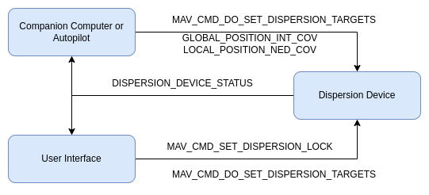
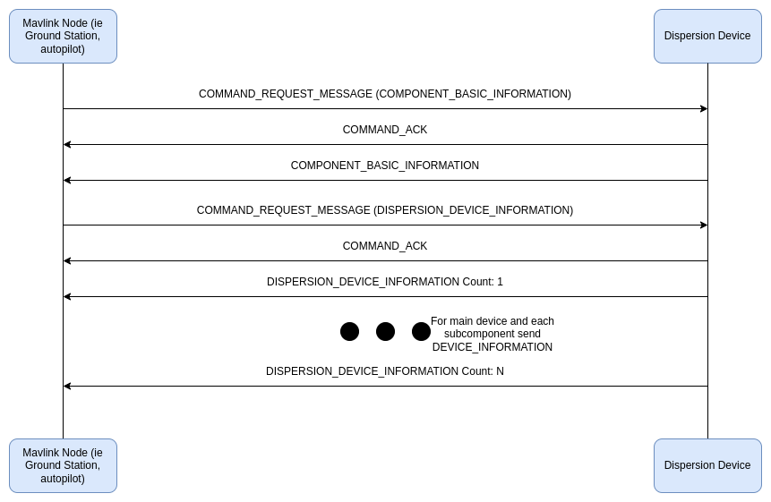
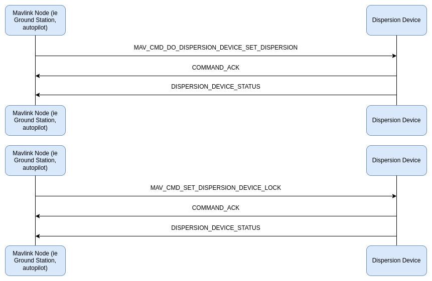

# Dispersion Microservice

## Introduction

The dispersion protocol allows MAVLink control over the dispersion devices mounted on a vehicle from a variety of sources. The dispersion state can be managed manually by an operator in real time or set as part of an auto mission.

The protocol defines what information is published, in what order for key workflow sequences for developers, configurators, and users of the vehicle. It also defines a logging framework for storage of that information.

The protocol supports a variety of hardware configurations, and enables dispersion systems with a variety of capabilities.

## Concepts

Key Terms:

| Term                                    | Description                                                                                                                                                                                                                               |
| :-------------------------------------- | :---------------------------------------------------------------------------------------------------------------------------------------------------------------------------------------------------------------------------------------- |
| Dispersion Device                       | A system containing one chemical mixture and the infrastructure to deliver that to a field                                                                                                                                                |
| Dispersion Component (aka Subcomponent) | A discrete unit of the dispersion device that has independent dispersion rate control. Depending on the hardware configuration, there could be no subcomponents, all the way to a subcomponent per nozzle for independent nozzle control. |

There are a few ways to interact with the dispersion device that can be categorized as follows:

- hardware configuration - low frequency device hardware changes that impact the behavior of dispersion device for long periods of time. These parameters are managed via [Parameter Protocol](https://mavlink.io/en/services/parameter.html).
- job configuration - optional use of perscription maps to define expected dispersion device behavior. These are managed via the [File Transfer Protocol](https://mavlink.io/en/services/ftp.html).
- navigation - high frequency messages providing real time vehicle navigation information to the device for making real time corrections
- control - optional use of MAVLink commands to make adjusts to dispersion behavior or control behavior through automated mission plans
- locking - provides a locking and unlocking mechanism, that ensures the dispersion device stops dispersing and does not respond to control messages when locked
- status - custom MAVLink messages are used to report the device state at a scheduled interval or on key events
- logging - all dispersion related mavlink messages are logged and that data can be managed via the [File Transfer Protocol](https://mavlink.io/en/services/ftp.html).

### Recommended Hardware Set-up

This protocol is designed to work best with a standalone MAVLink dispersion device that shares a high throughput, low latency communication bus with its controller. While any MAVLink source can be used to control the device, a common configuration is to have an autopilot providing critical real time vehicle position and trajectory data and a user interface to manage locking or low frequency control and configuration.

### Hardware Configuration

A dispersion device can take many form factors with spray devices being the most variable. It is very common to have different spray boom widths and variable nozzle spacing. Each nozzle can also have a unique limit range for flow rate, pressure, and droplet size. Since you might have anywhere from one nozzle to a couple hundred nozzles. While this hardware configuration can change, it is not typically during the middle of a job and is something you would expect to persist through power cycles. That makes the [Parameter Protocol](https://mavlink.io/en/services/parameter.html) a really good candidate for this scenario. It also provides a good infrastructure to save common configurations as param files.

### Job Confiugration

There is job specific information that sometimes must be provided to the dispersion device before each mission but does not belong in the real time control messages during the mission. This information should make use of the [Parameter Protocol](https://mavlink.io/en/services/parameter.html) when possible. At the time of writing, the only known case that would not work for the [Parameter Protocol](https://mavlink.io/en/services/parameter.html) is delivering prescription maps to the dispersion device. These files should be provided through the [File Transfer Protocol](https://mavlink.io/en/services/ftp.html) infrastructure to the target url provided in [DISPERSION_DEVICE_INFORMATION](#dispersion_device_information).

### Operation

A dispersion device has 3 primary methods for accomplishing its task. The first method relies on direct manual control via a MAVLink command to assign dispersion targets for every subcomponent of the dispersion device. This concept applies to devices ranging from no subcomponent to hundreds. You would typically only see this used when making minor corrections to a specific component or you apply the same requiremetns to all subcomponents. The second method relies on automated control from an autopilot. In this case, the autopilot provides a MAVLink command to assign dispersion targets for every subcomponent of the dispersion device as specific location. Since the autopilot only has vehicle position estimations and no sense of each individual subcomponent position, you would typically only see this used when it applies to all subcomponents. Internally the dispersion device can make additional corrections to heading changes. The third method requires a prescription map be provided to the dispersion device and the vehicle to provide kinematic information. The dispersion device can account from prescription expectation, vehicle kinematics, and hardware configuration to deliver individualized component control.

### Logging

To accomodate the creation of effectiveness and compliance reports for a specific application, a mini logging infrastructure is proposed. Effectively all MAVLink messages as handled by the Dispersion Device should be logged into a binary file that can then be retrieved using the [File Transfer Protocol](https://mavlink.io/en/services/ftp.html) pointed at the `logger_dir_ftp_url` on [DISPERSION_DEVICE_INFORMATION](#dispersion_device_information). This logging logic should take place within the Dispersion Device. See [logging implementation details](#logging-implementation).

## Implementation and Messages

### Discovery of Dispersion Device

The MAVlink nodes that need to communicate with Dispersion Devices start the process by sending a broadcast [MAV_CMD_REQUEST_MESSAGE](https://mavlink.io/en/messages/common.html#MAV_CMD_REQUEST_MESSAGE) for [COMPONENT_BASIC_INFORMATION](https://mavlink.io/en/messages/common.html#COMPONENT_INFORMATION_BASIC). Every dispersion device should respond with a [COMPONENT_BASIC_INFORMATION](https://mavlink.io/en/messages/common.html#COMPONENT_INFORMATION_BASIC). For more information specific to the dispersion device and its capability, a [MAV_CMD_REQUEST_MESSAGE](https://mavlink.io/en/messages/common.html#MAV_CMD_REQUEST_MESSAGE) for [DISPERSION_DEVICE_INFORMATION](#dispersion_device_information) should be sent. The target dispersion device should respond with [DISPERSION_DEVICE_INFORMATION](#dispersion_device_information) for each component. A component id of zero indicates the message represents the device as a whole.

The MAVLink node should then create as many interface instances as Dispersion Devices found.

### Control of a Dispersion Device

Device control refers to messages that can change the state of the dispersion device and its subcomponents. There are only two types of control messages: the [MAV_CMD_DO_SET_DISPERSION_TARGETS](#mav_cmd_do_set_dispersion_targets) message for assigning a target dispersion rate and the [MAV_CMD_SET_DISPERSION_LOCK](#mav_cmd_set_dispersion_lock) for locking the dispersion device in case of unexpected behavior. The lock message always takes precendence so if the device or its components is locked, all dispersion will cease and all incoming control messages that are not "unlock" will be ignored. The lock is intended to serve as an emergency off. When the system is unlocked, the dispersion device will respond to control messages in the order that they are received no matter the source. When it comes to precision dispersion, low latency is critical. If you are applying a payload at 15m/s and want to have an uncertainty at the CM level, the overall latency from position measurement to action must be approximately 1/100th of a second. There are obviously many levers an end user can pull to account for higher latency, but it is worth noting effort should be made to reduce this latency. It is recommended position gates are anticipated on the autopilot and blocking receives are utilized on the dispersion device. There should be a low latency communication bus between the two.

All control messages are handled via the pre-existing [MAVLink command microservice](https://mavlink.io/en/services/command.html).Autopilots can also use the mavlink command [MAV_CMD_DO_SET_DISPERSION_TARGETS](#mav_cmd_do_set_dispersion_targets) for real time dispersion device control in automated missions.

> **NOTE**
> Be discipline about conflicting control sources that are not the lock, as they will be processed in the order in which that are received. So if multiple controller instances of a given type exist, take care to keep them stateless or synchronize their state. For example, if there are multiple user interfaces with dispersion on/off buttons, it is critical that the button either always send the same command or if it changes between "dispersion on" and "dispersion off" depending on the current dispersion device state, that all interfaces reflect the same value.

> **NOTE**
> The [MAV_CMD_SET_DISPERSION_LOCK](#mav_cmd_set_dispersion_lock) messages should only be used as an emergency shutoff. All normal control should happen through the [MAV_CMD_DO_SET_DISPERSION_TARGETS](#mav_cmd_do_set_dispersion_targets) message. As an example, the lock message should be used to shut off the spray system when taking fallback actions like landing in place or returning home. The lock should not be used to turn the dispersion on or off at waypoints in an automated mission. In fact, a normal mission in general should never need to use the lock.

### Autopilot State for Dispersion Device

The autopilot should send the [GLOBAL_POSITION_INT_COV](#https://mavlink.io/en/messages/common.html#GLOBAL_POSITION_INT_COV) or [LOCAL_POSITION_NED_COV](#https://mavlink.io/en/messages/common.html#LOCAL_POSITION_NED_COV) message to the dispersion device. This data is required by the Dispersion Device control system to make effective dynamic dispersion rate corrections based on system current velocity. This message is not as critical as the timing for dispersion on and off but it does have an impact on coverage quality. A relatively low rate publish frequency of 10Hz or faster is likely ample since extrapolation can be utilized.

### Dispersion Device Broadcast/Status Messages

The dispersion device should send out its status in [DISPERSION_DEVICE_STATUS](#dispersion_device_status) at a low regular rate (e.g. 5 Hz) but also during key events such as a mavlink command, flag change, or rapid pressure change.

This message is a meant as broadcast, so it's sent to all parties on the network.

## Messages/Command/Enum Summary

This is the set of messages/enums for communication between a mavlink node and a dispersion device.

| Message                                                                                                                                                                                        | Description                                                                                                                                                                                                                                                                                                                                                                                      |
| :--------------------------------------------------------------------------------------------------------------------------------------------------------------------------------------------- | :----------------------------------------------------------------------------------------------------------------------------------------------------------------------------------------------------------------------------------------------------------------------------------------------------------------------------------------------------------------------------------------------- |
| [DISPERSION_DEVICE_INFORMATION](#dispersion_device_information)                                                                                                                                | Information about the dispersion device. This message should be requested by some source such as a ground control station using [MAV_CMD_REQUEST_MESSAGE](https://mavlink.io/en/messages/common.html#MAV_CMD_REQUEST_MESSAGE). The min/max limits for dispersion rate and pressure are driven by the underlying hardware. Software defined limits will be a subset of the limits specified here. |
| [DISPERSION_DEVICE_STATUS](#dispersion_device_status)                                                                                                                                          | Message reporting the status of a dispersion device. This message should be published a low regular rate (e.g. 5 Hz) but also during key events.                                                                                                                                                                                                                                                 |
| [GLOBAL_POSITION_INT_COV](#https://mavlink.io/en/messages/common.html#GLOBAL_POSITION_INT_COV) or [LOCAL_POSITION_NED_COV](#https://mavlink.io/en/messages/common.html#LOCAL_POSITION_NED_COV) | Message containing autopilot state relevant for a dispersion device. This message is to be sent from the autopilot to the dispersion device component. The data of this message are for the dispersion device estimator corrections, in particular speed compensation.                                                                                                                           |
| [COMPONENT_BASIC_INFORMATION](https://mavlink.io/en/messages/common.html#COMPONENT_INFORMATION_BASIC)                                                                                          | Message providing basic information about a MAVLink component. This message is meant to be sent by the dispersion device on request via [MAV_CMD_REQUEST_MESSAGE](https://mavlink.io/en/messages/common.html#MAV_CMD_REQUEST_MESSAGE).                                                                                                                                                           |

| Command                                                                                       | Description                                                                                                                                                                                   |
| :-------------------------------------------------------------------------------------------- | :-------------------------------------------------------------------------------------------------------------------------------------------------------------------------------------------- |
| [MAV_CMD_REQUEST_MESSAGE](https://mavlink.io/en/messages/common.html#MAV_CMD_REQUEST_MESSAGE) | Request the target system(s) emit a single instance of a specified message. This is used to request [DISPERSION_DEVICE_INFORMATION](#dispersion-device-information).                          |
| [MAV_CMD_DO_SET_DISPERSION_TARGETS](#mav_cmd_do_set_dispersion_targets)                       | Command to provide real time adjustment to dispersion device and subcomponent output.                                                                                                         |
| [MAV_CMD_SET_DISPERSION_LOCK](#mav_cmd_set_dispersion_lock)                                   | Command for locking/unlocking the device from responding to [MAV_CMD_DO_SET_DISPERSION_TARGETS](#mav_cmd_do_set_dispersion_targets) messages. When locked, the device should stop dispersing. |

| Enum                                                              | Description                                                                                                                  |
| :---------------------------------------------------------------- | :--------------------------------------------------------------------------------------------------------------------------- |
| [DISPERSION_DEVICE_CAP_FLAGS](#dispersion_device_cap_flags)       | Dispersion device capability flags (bitmap). Used in [DISPERSION_DEVICE_INFORMATION](#dispersion_device_information).        |
| [DISPERSION_DEVICE_STATUS_FLAGS](#dispersion_device_status_flags) | Flags for dispersion device operation (bitmap). Used in [DISPERSION_DEVICE_STATUS](#dispersion_device_status).               |
| [DISPERSION_DEVICE_ERRORS](#dispersion_device_errors)             | Dispersion device error flags (bitmap, 0 means no error). Used in [DISPERSION_DEVICE_STATUS](#dispersion_device_status).     |
| [DISPERSION_DEVICE_WARNINGS](#dispersion_device_warnings)         | Dispersion device warning flags (bitmap, 0 means no warning). Used in [DISPERSION_DEVICE_STATUS](#dispersion_device_status). |
| [MAV_DISPERSION_TYPE](#mav_dispersion_type)                       | The dispersion type a device is setup for. Dispersion types specify the units for capacity and dispersion rate.              |

## How to Implement the Dispersion Device Interface

### Microservice Dependencies

The disperison device is targeted to be a stand alone MAVLink device meaning it needs to support some existing MAVLink microservices beyond the dispersion microservice outlined above. The following microservices are required:

- [Heartbeat/Connection](https://mavlink.io/en/services/heartbeat.html)
- [Command](https://mavlink.io/en/services/command.html)
- [File Transfer Protocol](https://mavlink.io/en/services/ftp.html)
- [Ping](https://mavlink.io/en/services/ping.html)
- [Time Synchronization](https://mavlink.io/en/services/timesync.html)
- [Parameter Protocol](https://mavlink.io/en/services/parameter.html)

> **NOTE**
> There is not a microservice definition for this but there is a requirement to support [COMPONENT_INFORMATION_BASIC](https://mavlink.io/en/messages/common.html#COMPONENT_INFORMATION_BASIC)

### Device Parameters (Hardware Configuration)

A dispersion device can take many form factors with spray devices being the most variable. It is very common to have different spray boom widths and variable nozzle spacing. Each nozzle can also have a unique limit range for flow rate, pressure, and droplet size. Since you might have anywhere from one nozzle to a couple hundred nozzles. While this hardware configuration can change, it is not typically during the middle of a job and is something you would expect to persist through power cycles. That makes the [Parameter Protocol](https://mavlink.io/en/services/parameter.html) a really good candidate for this scenario. It also provides a good infrastructure to save common configurations as param files.

The definition of these parameters is an implementation detail so only a potential example parameter set for hardware configuration is proposed. It might look something like as follows:

| Name                             | Type    | Units                | Values   | Description                                                                                                                                                     |
| :------------------------------- | :------ | :------------------- | :------- | :-------------------------------------------------------------------------------------------------------------------------------------------------------------- |
| FILL_CAPACITY_MAX                | `float` | liters or kg         | positive | Maximum fill capacity of this device in Liters for sprayers and Kg for spreaders. Units are determined based on the DISPERSION_DEVICE_CAP_FLAGS. (liters or kg) |
| SUBCOMPONENT_COUNT               | `float` |                      |          | Number of subcomponents this device has.                                                                                                                        |
| COMPONENT_1_OFFSET_X             | `float` | m                    | positive | component 1 x position offset relative to device in meters                                                                                                      |
| COMPONENT_1_OFFSET_Y             | `float` | m                    | positive | component 1 y position offset relative to device in meters                                                                                                      |
| COMPONENT_1_OFFSET_Z             | `float` | m                    | positive | component 1 z position offset relative to device in meters                                                                                                      |
| COMPONENT_1_RATE_MAX             | `float` | liters/min or kg/min | positive | Maximum dispersion rate component 1 supports                                                                                                                    |
| COMPONENT_1_RATE_MIN             | `float` | liters/min or kg/min | positive | Minimum dispersion rate component 1 supports                                                                                                                    |
| COMPONENT_1_PRESSURE_MAX         | `float` | Pa                   | positive | Maximum pressure component 1 supports                                                                                                                           |
| COMPONENT_1_PRESSURE_MIN         | `float` | Pa                   | positive | Minimum pressure component 1 supports                                                                                                                           |
| COMPONENT_1_DROPLET_DIAMETER_MAX | `float` | um                   | positive | Maximum droplet diameter component 1 supports                                                                                                                   |
| COMPONENT_1_DROPLET_DIAMETER_MIN | `float` | um                   | positive | Minimum droplet diameter component 1 supports                                                                                                                   |
| ...                              | ...     | ...                  | ...      | ...                                                                                                                                                             |

### Logging Implementation

#### File Management

The dispersion device must be hosting a MAVFTP server to facilite the offloading of generated log data.

The device should be continuously logging every message in full fidelity using a rotating file handler that caps the file size to limit based on underlying compute specifications. There should be an additional limit to the number of files allowed before the oldest file is replaced. Each filename should end with it's count like follows: log.dspf, log.dspf.1, log.dspf.2, etc. It is recommended each file have a unique name by giving the base name a suffix of the created timestamp per the [RFC 3339](https://datatracker.ietf.org/doc/html/rfc3339) spec format. So an example file name might look like "dispersion_1996-12-19T16:39:57.112.dspf.12".

There should be an additional abbreviated log file that only logs during key events such as while dispersion is on or there are device errors. A configurable rolling window of messages (ie 30 seconds) should be maintained for before and after key events to additionally be logged. This abbreviated file format should also follow the same rotating habits as the continuous log.

Both of the log files above should follow the format outlined below and use the file extensions ".dspf" and ".dsp" respectively.

#### Log File Format

This log file should be a binary file with a maximum size limit dictated by the underlying device compute system. On log file creation, the file header as specified below should be written. After the header is the mavlink message definitions. The mavlink message definitions are to be written in the format of a single entry as noted below by writing the entire XML file repersentation as an entry payload. After the header, any number of entries can be added. This file can contain any data. Each entry into the file will have a header and payload.

It is expected that endianness match the mavlink spec for [pack format](https://mavlink.io/en/guide/serialization.html#packet_format) (little-endian).

The file structure has the following sections:

1. Header
1. Mavlink Definitions
1. Entries

File Header (30 bytes)

| Field          | Type     | Description                                                                                              |
| :------------- | :------- | :------------------------------------------------------------------------------------------------------- |
| uuid           | char[16] | A unique identifier for this log file.                                                                   |
| timestamp_us   | uint64_t | Unix timstamp that notes when logging started in microseconds.                                           |
| format_version | uint32_t | Version number for this file format.                                                                     |
| flags          | uint16_t | Set of flags to allow for various format changes. 0 means none of the flags apply. See FLAGS enum below. |

FLAGS Enum

| Value | Name            | Description                                                     |
| :---- | :-------------- | :-------------------------------------------------------------- |
| 1     | MAVLINK_ONLY    | Flag indicating this file only contains packed mavlink content. |
| 2     | NOT_TIMESTAMPED | Flag indicating each entity has a timestamp                     |

Mavlink Message Definitions (44 bytes without payload)

| Field             | Type     | Description                                                                                                                                               |
| :---------------- | :------- | :-------------------------------------------------------------------------------------------------------------------------------------------------------- |
| mav_version_major | uint32_t | MAVLink protocol major version.                                                                                                                           |
| mav_version_minor | uint32_t | MAVLink protocol minor version.                                                                                                                           |
| mav_dialect       | char[32] | [mavlink message dialect](https://mavlink.io/en/messages/) being used.                                                                                    |
| size              | uint32_t | Size of the following payload in bytes. 0 if definition xml file is not retrievable.                                                                      |
| payload           | N/A      | This payload is the utf-8 encoding of the xml file definition for the mavlink messages being used during this logging process. This payload can be empty. |

Entries (0-11 bytes without payload)

As many entries as there are room to write can be appended to the file content post mavlink definitions. Each entry could have up to the following structure. Each field in the following structure is optional as determined by the flags listed above.

| Field        | Type     | Description                                                                                                                                       |
| :----------- | :------- | :------------------------------------------------------------------------------------------------------------------------------------------------ |
| type         | uint8_t  | This indicates the payload type. See ENTRY_TYPE enum below. This field is NOT present if the MAVLINK_ONLY flag is set.                            |
| timestamp_us | uint64_t | Unix timestamp in microseconds for which this corresponding payload was acted upon. This field is NOT present if the NOT_TIMESTAMPED flag is set. |
| size         | uint16_t | Size of the entry in bytes without the header. This field is NOT present if the MAVLINK_ONLY flag is set.                                         |
| payload      | N/A      | Any bytes content.                                                                                                                                |

ENTRY_TYPE Enum

| Value | Name    | Description                  |
| :---- | :------ | :--------------------------- |
| 0     | RAW     | Catch all for raw bytes data |
| 1     | MAVLINK | Entry is a mavlink message   |
| 2     | TEXT    | Entry is UTF-8 encoded text  |

### Messages to Send

The messages listed below should be broadcast on the network/on all connections (sent to everyone). This set is not comprehensive in that it does not necessarily reiterate what is already defined in the pre-existing microservices documented as a dependency above. It is expected those messages get implemented as well.

[HEARTBEAT](https://mavlink.io/en/messages/common.html#HEARTBEAT)

Heartbeats should always be sent (usually at 1 Hz).

> **WARNING**
> Dispersion devices that set their `sysid` from the autopilot will need to wait for the autopilot's heartbeat before emitting their own (note that if the dispersion device can receive heartbeats from multiple autopilots then the `sysid` must be explicitly/statically configured).

- `sysid`: the same sysid as the autopilot (this can either be done by configuration, or by listening to the autopilot's heartbeat first and then copying the sysid, default: 1)
- `compid`: [MAV_COMP_ID_DISPERSIONER](#mav_comp_id_dispersioner)
- `type`: [MAV_TYPE_DISPERSION](#mav_type_dispersion)
- `autopilot`: [MAV_AUTOPILOT_INVALID](https://mavlink.io/en/messages/common.html#MAV_AUTOPILOT_INVALID)
- `base_mode`: 0
- `custom_mode`: 0
- `system_status`: `MAV_STATE_UNINIT`

[DISPERSION_DEVICE_STATUS](#dispersion_device_status)

The dispersion device status should be published a low regular rate (e.g. 5 Hz) but also during key events such as a mavlink command, flag change, or rapid pressure change for each subcomponent and the device itself.

> **IMPORTANT**
> When publishing the status message in response to key events, it is essential that the status message timestamp aligns with when that event was enacted otherwise leading and falling edge detection during post processing of the data will incorrectly represent the world.

[COMPONENT_BASIC_INFORMATION](https://mavlink.io/en/messages/common.html#COMPONENT_INFORMATION_BASIC)

This information should be published in response to a [MAV_CMD_REQUEST_MESSAGE](https://mavlink.io/en/messages/common.html#MAV_CMD_REQUEST_MESSAGE) on startup.

[DISPERSION_DEVICE_INFORMATION](#dispersion_device_information)

The static information about the dispersion device needs to be sent out when requested using [MAV_CMD_REQUEST_MESSAGE](https://mavlink.io/en/messages/common.html#MAV_CMD_REQUEST_MESSAGE).

### Messages to Listen To/Handle

This set is not comprehensive in that it does not necessarily reiterate what is already defined in the pre-existing microservices documented as a dependency above. It is expected those messages get implemented as well.

[GLOBAL_POSITION_INT_COV](#https://mavlink.io/en/messages/common.html#GLOBAL_POSITION_INT_COV) or [LOCAL_POSITION_NED_COV](#https://mavlink.io/en/messages/common.html#LOCAL_POSITION_NED_COV)

One of the above two messages must be provided by the autopilot so the dispersion device can correct the dispersion behavior to account for changes in vehicle performance. The GLOBAL_POSITION_INT_COV should be provided if the reference frame for the system is MAV_FRAME_GLOBAL and the LOCAL_POSITION_NED_COV should be used if the reference frame for the system is MAV_FRAME_LOCAL_NED.

The device should utilize which message is provided to determine its coordinate frame and then confirm there is no inconsistency in expected coordinate frame across all the data it will use to accomplish the task.

If this message the rate is not ok, the command [MAV_CMD_SET_MESSAGE_INTERVAL](https://mavlink.io/en/messages/common.html#MAV_CMD_SET_MESSAGE_INTERVAL) can be used to request it at a certain rate.

[COMMAND_LONG](https://mavlink.io/en/messages/common.html#COMMAND_LONG)

The dispersion device needs to check for commands. See below which commands should get answered.

### Commands to Answer

[MAV_CMD_REQUEST_MESSAGE](https://mavlink.io/en/messages/common.html#MAV_CMD_REQUEST_MESSAGE)

The dispersion device should send out messages when they get requested, e.g. DISPERSION_DEVICE_INFORMATION, [COMPONENT_BASIC_INFORMATION](https://mavlink.io/en/messages/common.html#COMPONENT_INFORMATION_BASIC).

[MAV_CMD_SET_MESSAGE_INTERVAL](https://mavlink.io/en/messages/common.html#MAV_CMD_SET_MESSAGE_INTERVAL)

The dispersion device should stream messages at the rate requested.

[MAV_CMD_DO_SET_DISPERSION_TARGETS](#mav_cmd_do_set_dispersion_targets)

Command to provide real time adjustment to dispersion device or subcomponent output.

[MAV_CMD_SET_DISPERSION_LOCK](#mav_cmd_set_dispersion_lock)

Command for locking/unlocking the device from responding to [MAV_CMD_DO_SET_DISPERSION_TARGETS](#mav_cmd_do_set_dispersion_targets) messages. When locked, the device should stop dispersing.
