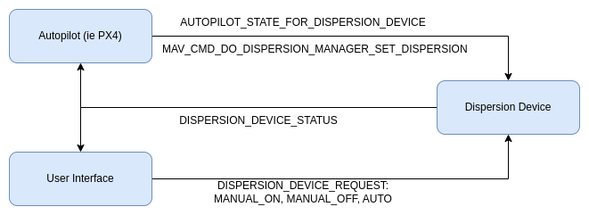
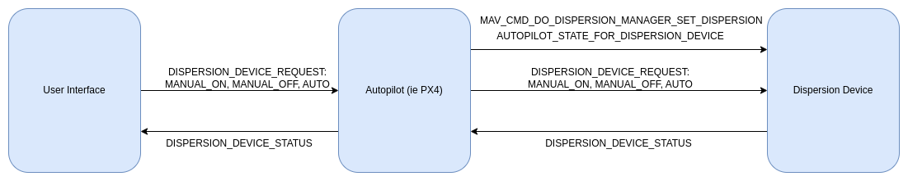
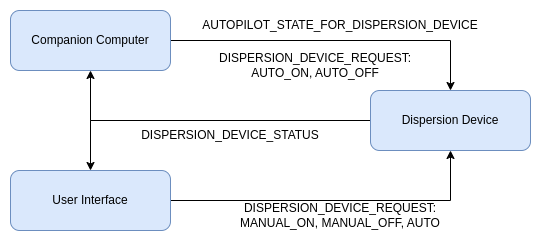
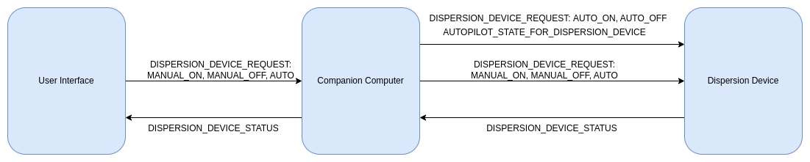
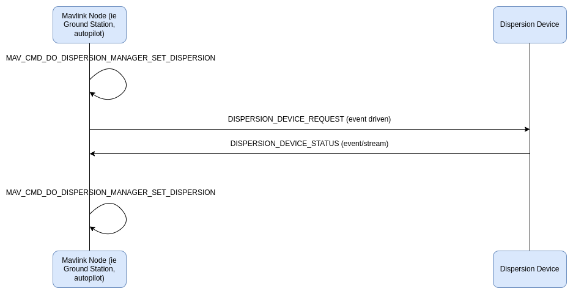

# Dispersion Microservice

## Introduction

The dispersion protocol allows MAVLink control over the dispersion devices mounted on a vehicle from a variety of sources. The dispersion state can be managed manually by an operator in real time or set as part of an auto mission.

The protocol also defines what information is published, in what order for key workflow sequences for developers, configurators, and users of the vehicle.

The protocol supports a variety of hardware configurations, and enables dispersion systems with a variety of capabilities.

## Concepts

The dispersion device control requests fit into two main categories AUTO and MANUAL. A manual request will always override an AUTO command and should immediately take effect. MANUAL requests should be directly tied to a deliberate user action. An AUTO request, on the other hand, should only come from an automated control device and only be allowed if the dispersion device is configured for an AUTO mode before those control requests are received.

### Common Hardware Set-ups

This section outlines the most common hardware set-ups. All set-ups are based on the general understanding that some compute whether a companion device or autopilot is providing real time flight data and control to the dispersion device during an automated mission while another device might provide a user interface for manual control of the device.

#### Dispersion Device Connected to Autopilot

In this model an autopilot is connected the mavlink dispersion device and provides real time flight and control data during an automated mission and a user interface allows an operator to take over manual control. This concept applies whether the user interface computer directly communicates with the dispersion device or passes through the autopilot.

#### Dispersion Device Connected to Companion Computer

In this model a companion computer is connected the mavlink dispersion device and provides real time flight and control data during an automated mission and a user interface allows an operator to take over manual control. This concept applies whether the user interface computer directly communicates with the dispersion device or passes through the companion computer.

### Logging

The data outlined in this microservice is essential for compliance and efficacy of job done reporting. It is strongly recommended that this information be logged in a predictable manner.

## Implementation and Messages

### Discovery of Dispersion Device

The MAVlink nodes that need to communicate with Dispersion Devices do so by sending a broadcast [MAV_CMD_REQUEST_MESSAGE](https://mavlink.io/en/messages/common.html#MAV_CMD_REQUEST_MESSAGE) for [DISPERSION_DEVICE_INFORMATION](#dispersion_device_information). Every dispersion device should respond with [DISPERSION_DEVICE_INFORMATION](#dispersion_device_information).

The MAVLink node should then create as many interface instances as Dispersion Devices found.

### Control of a Dispersion Device

To control the pressure or dispersion rate of the Dispersion Device, use the message [DISPERSION_DEVICE_REQUEST](#dispersion_device_request) with request type MANUAL_ON, or AUTO_ON and the associated parameters. Request types MANUAL_OFF and AUTO_OFF can be sent without parameters to turn off the device. Each request will be acked by a [DISPERSION_DEVICE_STATUS](#dispersion_device_status) with the request message's signature. The dispersion device will respond to control messages in the order that they are received.

Autopilots can also use the mavlink command [MAV_CMD_DO_DISPERSION_DEVICE_SET_DISPERSION](#mav_cmd_do_dispersion_device_set_dispersion) for real time dispersion device control but in a limited scope. This command with always be treated the same as either AUTO_ON or AUTO_OFF and the only parameter that can be assigned is the dispersion rate.

> [!NOTE]
> Be discipline about conflicting control sources of the same type (MANUAL OR AUTO) as they will be processed in the order in which that are received. So if multiple controller instances of a given type exist, take care to keep them stateless or synchronize their state. For example, if there are multiple user interfaces with dispersion on/off buttons, it is critical that the button either always send the same command or if it changes between "dispersion on" and "dispersion off" depending on the current dispersion device state, that all interfaces reflect the same value.

### Configure a Dispersion Device for Swappable Hardware

To configure the Dispersion Device parameters due to in field configuration changes such as nozzle swapping, the [DISPERSION_DEVICE_REQUEST](#dispersion_device_request) can be used with request type AUTO, MANUAL_ON, or AUTO_ON and by providing the software defined min/max dispersion rate and pressure map parameters. Each request will be acked by a [DISPERSION_DEVICE_STATUS](#dispersion_device_status) with the request message's signature.

### Autopilot State for Dispersion Device

The autopilot should also send the message [AUTOPILOT_STATE_FOR_DISPERSION_DEVICE](#autopilot_state_for_dispersion_device) to the dispersion device. This data is required by the Dispersion Device control system to make effective dynamic dispersion rate corrections based on system current and projected speed. It will also send the relevant [MAV_CMD_DO_DISPERSION_DEVICE_SET_DISPERSION](#mav_cmd_do_dispersion_device_set_dispersion) commands when tagging the associated waypoints.

### Dispersion Device Broadcast/Status Messages

The dispersion device should send out its status in [DISPERSION_DEVICE_STATUS](#dispersion_device_status) at a regular rate, e.g. 10 Hz, and when key events such as a new request occurs.

This message is a meant as broadcast, so it's sent to all parties on the network.

## Messages/Command/Enum Summary

This is the set of messages/enums for communication between a mavlink node and a dispersion device.

| Message                                                                         | Description                                                                                                                                                                                                                                                                                                                                                                                   |
| :------------------------------------------------------------------------------ | :-------------------------------------------------------------------------------------------------------------------------------------------------------------------------------------------------------------------------------------------------------------------------------------------------------------------------------------------------------------------------------------------- |
| [DISPERSION_DEVICE_INFORMATION](#dispersion_device_information)                 | Information about a low level dispersion device. This message should be requested by some source such as a ground control station using [MAV_CMD_REQUEST_MESSAGE](https://mavlink.io/en/messages/common.html#MAV_CMD_REQUEST_MESSAGE). The min/max limits for dispersion rate and pressure are driven by the underlying hardware. Software defined limits will be a subset of the limits specified here. |
| [DISPERSION_DEVICE_STATUS](#dispersion_device_status)                           | Message reporting the low level status of a dispersion device. This message should be published a low regular rate (e.g. 5 Hz) but also during key events such a flag change.                                                                                                                                                                                                                 |
| [DISPERSION_DEVICE_REQUEST](#dispersion_device_request)                         | Low level message to control a dispersion device's application rate. For certain requests you can expect some parameters to be ignored. (e.g. a dispersion off request will not use any rate, pressure, or speed values)                                                                                                                                                                      |
| [AUTOPILOT_STATE_FOR_DISPERSION_DEVICE](#autopilot_state_for_dispersion_device) | Low level message containing autopilot state relevant for a dispersion device. This message is to be sent from the autopilot to the dispersion device component. The data of this message are for the dispersion device estimator corrections, in particular speed compensation.                                                                                                              |

| Command                                                                                       | Description                                                                                                                                                          |
| :-------------------------------------------------------------------------------------------- | :------------------------------------------------------------------------------------------------------------------------------------------------------------------- |
| [MAV_CMD_REQUEST_MESSAGE](https://mavlink.io/en/messages/common.html#MAV_CMD_REQUEST_MESSAGE) | Request the target system(s) emit a single instance of a specified message. This is used to request [DISPERSION_DEVICE_INFORMATION](#dispersion_device_information). |

| Enum                                                              | Description                                                                                                                          |
| :---------------------------------------------------------------- | :----------------------------------------------------------------------------------------------------------------------------------- |
| [DISPERSION_DEVICE_CAP_FLAGS](#dispersion_device_cap_flags)       | Dispersion device low level capability flags (bitmap). Used in [DISPERSION_DEVICE_INFORMATION](#dispersion_device_information).      |
| [DISPERSION_DEVICE_STATUS_FLAGS](#dispersion_device_status_flags) | Flags for dispersion device (low level) operation (bitmap). Used in [DISPERSION_DEVICE_STATUS](#dispersion_device_status).           |
| [DISPERSION_DEVICE_REQUESTS](#dispersion_device_requests)         | Dispersion device (low level) requests. Used in [DISPERSION_DEVICE_REQUEST](#dispersion_device_request).                             |
| [DISPERSION_DEVICE_ERRORS](#dispersion_device_errors)             | Dispersion device (low level) error flags (bitmap, 0 means no error). Used in [DISPERSION_DEVICE_STATUS](#dispersion_device_status). |

## Sequences

Depicted below are message sequences for common scenarios.

### Discovery

The following diagram shows a possible sequence on startup that enables a ground station to discover a dispersion device and get its associated information.

### Control / Configuration

Control of the dispersion system should be event driven, though the dispersion device status should be both at a regular cadence as well as driven by key events such as dispersion on and dispersion off. This sequence applies to requesting dispersion on and off as well as manually configuring the dispersion device before starting an automated mission. The user has the ability to swap out nozzles fairly regularly so the configuration step is needed to handle nozzle specific configuration data. Each request message has a request type and optional parameters to support the different control and configuration needs.

### Autopilot Control

For this case the dispersion device is controlled via an autopilot which can send dispersion control requests throughout an automated mission via the [MAV_CMD_DO_DISPERSION_DEVICE_SET_DISPERSION](#mav_cmd_do_dispersion_device_set_dispersion) command.

## How to Implement the Dispersion Device Interface

### Messages to Send

The messages listed should be broadcast on the network/on all connections (sent to everyone).

[HEARTBEAT](https://mavlink.io/en/messages/common.html#HEARTBEAT)

Heartbeats should always be sent (usually at 1 Hz).

> [!WARNING]
> Dispersion devices that set their `sysid` from the autopilot will need to wait for the autopilot's heartbeat before emitting their own (note that if the dispersion device can receive heartbeats from multiple autopilots then the `sysid` must be explicitly/statically configured).

- `sysid`: the same sysid as the autopilot (this can either be done by configuration, or by listening to the autopilot's heartbeat first and then copying the sysid, default: 1)
- `compid`: [MAV_COMP_ID_DISPERSIONER](#mav_comp_id_dispersion)
- `type`: [MAV_TYPE_DISPERSIONER](#mav_type_dispersion)
- `autopilot`: [MAV_AUTOPILOT_INVALID](https://mavlink.io/en/messages/common.html#MAV_AUTOPILOT_INVALID)
- `base_mode`: 0
- `custom_mode`: 0
- `system_status`: `MAV_STATE_UNINIT`

[DISPERSION_DEVICE_STATUS](#dispersion_device_status)

The dispersion device should out its status at a regular rate, e.g. 10 Hz and on key events like dispersion on and dispersion off. The fields like target_system and target_component can be set to 0 (broadcast) by default.

[DISPERSION_DEVICE_INFORMATION](#dispersion_device_information)

The static information about the dispersion device needs to be sent out when requested using [MAV_CMD_REQUEST_MESSAGE](https://mavlink.io/en/messages/common.html#MAV_CMD_REQUEST_MESSAGE).

### Messages to Listen To/Handle

[DISPERSION_DEVICE_REQUEST](#dispersion_device_request)

This is the request that the dispersion device should follow. The primary purpose is to turn on and off the dispersion system but this can also be used for run time dispersion system configuration.

[MAV_CMD_DO_DISPERSION_DEVICE_SET_DISPERSION](#mav_cmd_do_dispersion_device_set_dispersion)

This is a subset of the [DISPERSION_DEVICE_REQUEST](#dispersion_device_request) brought into the Mavlink command structure so that autopilots can easily integrate control functionality into automated missions.

[AUTOPILOT_STATE_FOR_DISPERSION_DEVICE](#autopilot_state_for_dispersion_device)

The dispersion device should be able to get all the information from the autopilot that it requires in this one message. If something is missing that should be streamed at a high rate, it should be added to this message.

If this message is not sent by default by the autopilot, or the rate is not ok, the command [MAV_CMD_SET_MESSAGE_INTERVAL](https://mavlink.io/en/messages/common.html#MAV_CMD_SET_MESSAGE_INTERVAL) can be used to request it at a certain rate.

[COMMAND_LONG](https://mavlink.io/en/messages/common.html#COMMAND_LONG)

The dispersion device needs to check for commands. See below which commands should get answered.

### Commands to Answer

[MAV_CMD_REQUEST_MESSAGE](https://mavlink.io/en/messages/common.html#MAV_CMD_REQUEST_MESSAGE)

The dispersion device should send out messages when they get requested, e.g. DISPERSION_DEVICE_INFORMATION.

[MAV_CMD_SET_MESSAGE_INTERVAL](https://mavlink.io/en/messages/common.html#MAV_CMD_SET_MESSAGE_INTERVAL)

The dispersion device should stream messages at the rate requested.
