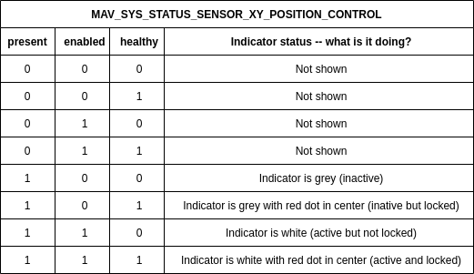
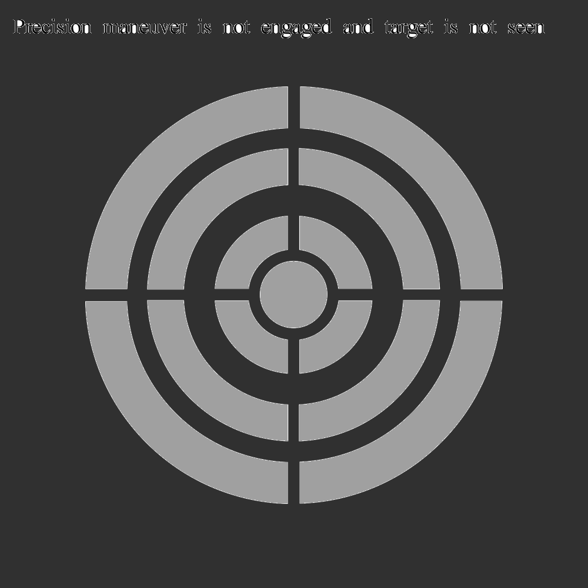
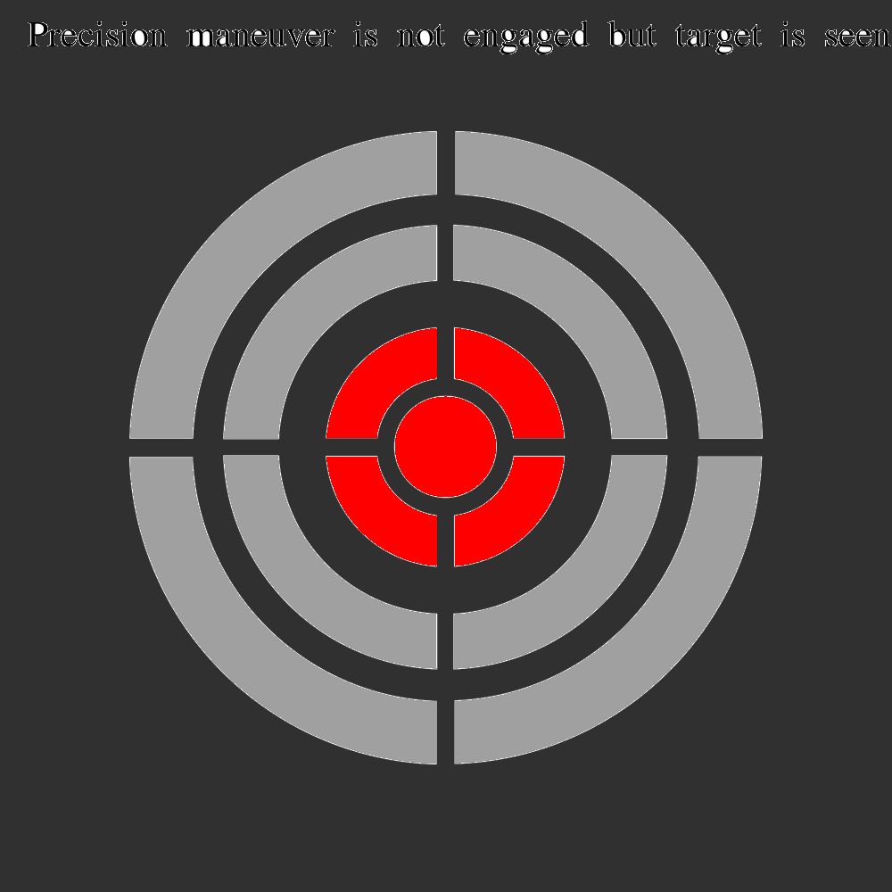
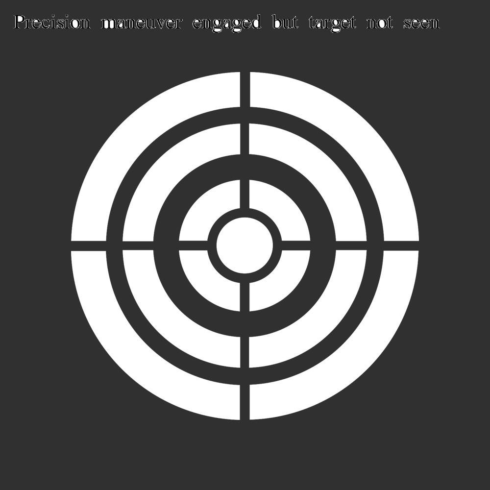
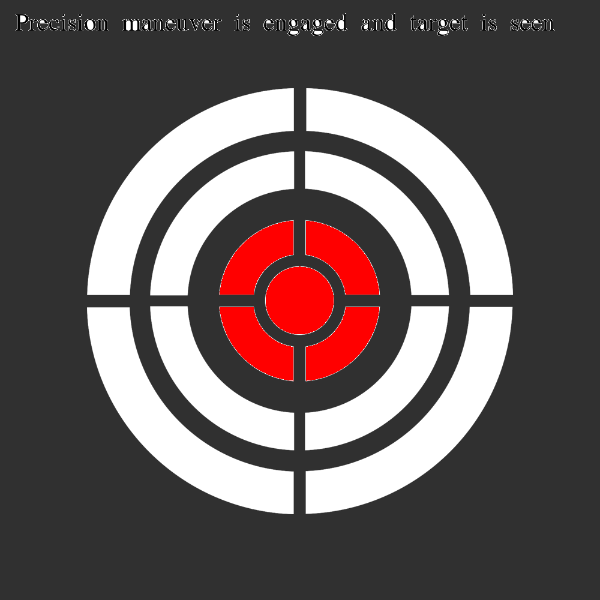

  * Start date: 2022-11-07
  * Contributors: Jacob Dahl <dahl.jakejacob@gmail.com>
  * Related issues: https://github.com/mavlink/mavlink/pull/1858

# Summary

When interacting with a [Landing Target](https://mavlink.io/en/services/landing_target.html) it is useful to the user to know the current state of the
precision maneuver -- ie Precision Land.

# Motivation

A failed precision landing could result in a vehicle crash, for example if the vehicle is landing on a small landing pad and loses the target during descent. In this scenario, it is critical that the operator knows the current status of the precision landing maneuver so that they can take control of the drone in the case the maneuver fails. The failure case for precision land (in PX4) is to fallback to a
normal land, and this may not be desirable under certain circumstances. It is also useful to know if the precision landing system can see a target,
regardless of whether the vehicle is actively performing a precision maneuver. This allows an operator to at-a-glance confirm if the precision targetting
system is working properly.

# Detailed Design

MAVLink already supports the concept of "Sensor Status" via the MAV_SYS_STATUS_SENSOR and MAV_SYS_STATUS_SENSOR_EXTENDED bitmasks in the [SYS_STATUS](https://mavlink.io/en/messages/common.html#SYS_STATUS) message. I have implemented this functionality using MAV_SYS_STATUS_SENSOR_XY_POSITION_CONTROL but I propose that we create a new purpose built bitmask MAV_SYS_STATUS_SENSOR_PRECISION_TARGETTING.

A Ground Control Station (QGC) could then display an indicator in the top toolbar as a function of these states. These images are for demonstration,
when integrated upstream a separate discussion will be held to align on the best image for the indicator. \
 \

There are logically only 5 states of interest:
1. The system does not support precision maneuvers.
2. The system supports precision maneuvers, the maneuver is not active, no target is seen
3. The system supports precision maneuvers, the maneuver is not active, the target is seen
4. The system supports precision maneuvers, the maneuver is active, no target is seen
5. The system supports precision maneuvers, the maneuver is active, the target is seen

Each one of these states are important on their own.

# Alternatives

Do nothing. There is no way to determine the state of a precision maneuver.
